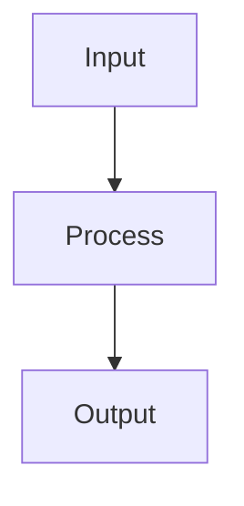

# Markdown

Write plain text that is readable raw AND rendered, following GFM conventions.

## When to Use

- Writing documentation, READMEs, or session logs
- Creating structured content that works in any editor and on GitHub
- Formatting prose that LLMs can produce and consume fluently
- Building collapsible, navigable documents for long-form content

## Core Principles

- **Readable without rendering** — open in any editor, understand instantly
- **Git-friendly** — diffs are meaningful, merges work, history is readable
- **LLM-native** — models are trained on billions of .md files and speak it fluently
- **No lock-in** — plain text survives every platform, every decade

## GFM Extensions

### Tables

```markdown
| Feature | Status |
|---------|--------|
| Navigation | Done |
| Inventory | WIP |
```

### Task Lists

```markdown
- [x] Define schema
- [ ] Build linter
```

### Collapsible Sections

```html
<details>
<summary><strong>Section Title — key points here</strong></summary>

Detailed content goes here.

</details>
```

Use `<details open>` for must-read sections; closed `<details>` for optional depth. Put key points in the `<summary>` tag so readers can decide without expanding.

### Alerts (GitHub-specific)

```markdown
> [!NOTE]
> Useful information.

> [!WARNING]
> Critical information.
```

### Mermaid Diagrams



Use for flowcharts, sequence diagrams, state machines, and ERDs.

## Best Practices

1. **Index at top** — add `## Index` with anchor links for long documents
2. **Collapsible details** — hide complexity, show structure; let readers scan summaries
3. **Tables for structured data** — when information has parallel structure
4. **Fenced code blocks** — always include language hint (```yaml, ```python)
5. **Blockquotes for emphasis** — use for key quotes or callouts

## Anti-Patterns

- Over-nesting headers beyond 4 levels
- Inline HTML everywhere (defeats plain-text readability)
- Wall of text without headers or sections
- Proprietary extensions (stick to GFM for portability)
- Content only readable when rendered
